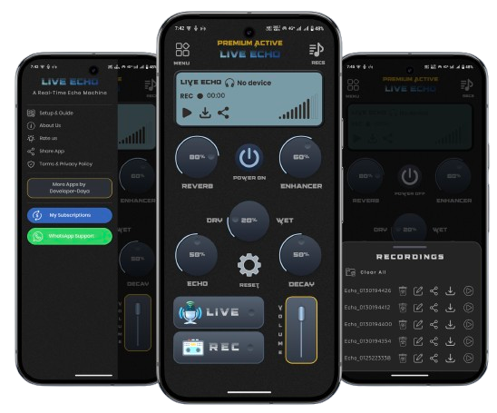
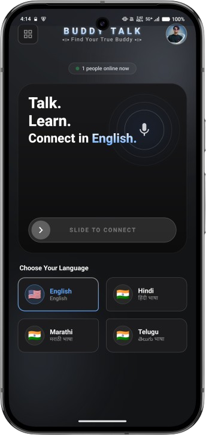
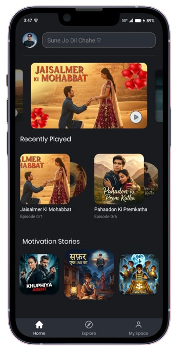
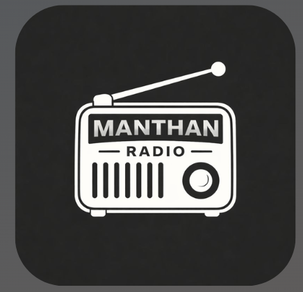
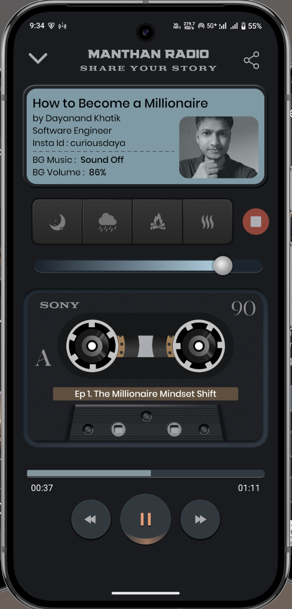

<h1 align="center">Hi 👋, I'm Dayanand Khatik</h1>
<h3 align="center">🚀 Senior Android Engineer</h3>

  

---

# 💫 About Me:

👨‍💻 Full Stack Android Developer with **5+ years** of experience building scalable, high-performance Android applications. Specialized in modern architecture, clean code practices, performance optimization, and end-to-end product ownership, with expertise in Kotlin, Jetpack Compose, MVVM, and scalable mobile system design.

- 🚀 Specialized in **Modern Android Development**
- 🏗️ Strong advocate of **Clean Architecture, SOLID Principles & Scalable Design**
- 🌱 Currently exploring **KMP, Compose Multiplatform & Backend Development**

---

# 🌐 Socials:

  
  
  
  

---

# 💻 Tech Stack:

### Languages

### Android

### Libraries & Tools

### Backend & DevOps

---

# 🚀 Featured Projects

<table width="100%">
  <tr>
    <td width="50%" align="center">
      

        
        <h3 style="margin: 0 0 5px 0;">Live Echo Mic</h3>
        100K+ 
        Downloads
         
      

      

        
      

      
    </td>
    <td width="50%" align="center">
      

        
        <h3 style="margin: 0 0 5px 0;">Buddy Talk</h3>
        1K+ 
        Downloads
         
      

      

        
      

      
    </td>
  </tr>
  <tr>
    <td width="50%" align="center">
      

        
        <h3 style="margin: 0 0 5px 0;">Koyal FM</h3>
        100+ 
        Downloads
         
      

      

        
      

      
    </td>
    <td width="50%" align="center">
      

        
        <h3 style="margin: 0 0 5px 0;">Manthan Radio</h3>
        100+ 
        Downloads
         
      

      

        
      

      
    </td>
  </tr>
</table>

